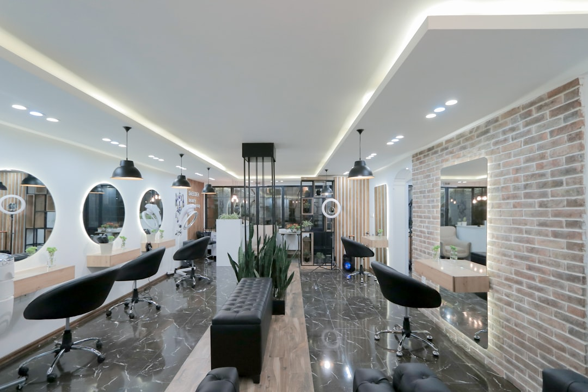

# Art of Skin Care - Premium Beauty Salon Website

A stunning, award-worthy website for Art of Skin Care, a premier beauty salon in Somerset, NJ. Built with Next.js 14, TypeScript, Tailwind CSS, and Framer Motion.



## ✨ Features

- **Stunning Design**: Premium, Awwwards-level aesthetics with attention to every detail
- **Smooth Animations**: Powered by Framer Motion for buttery-smooth transitions and interactions
- **Dark/Light Mode**: Seamless theme switching with system preference detection
- **Responsive**: Mobile-first design that looks beautiful on all devices
- **SEO Optimized**: Complete with meta tags, Open Graph, and JSON-LD structured data
- **Performance**: Optimized images, code splitting, and lazy loading
- **Accessibility**: WCAG 2.1 compliant with proper focus states and semantic HTML

## 🛠 Tech Stack

- **Framework**: Next.js 14 (App Router)
- **Language**: TypeScript
- **Styling**: Tailwind CSS
- **Animations**: Framer Motion
- **Icons**: Lucide React
- **Fonts**: Google Fonts (Cormorant Garamond, Montserrat, Playfair Display)

## 📁 Project Structure

```
art-of-skin-care-website/
├── app/
│   ├── layout.tsx          # Root layout with SEO & providers
│   ├── page.tsx            # Homepage
│   ├── globals.css         # Global styles & design system
│   ├── about/page.tsx      # About page
│   ├── services/page.tsx   # Services page
│   ├── portfolio/page.tsx  # Portfolio gallery
│   └── contact/page.tsx    # Contact form
├── components/
│   ├── layout/
│   │   ├── Navbar.tsx      # Animated navigation
│   │   └── Footer.tsx      # Footer with links
│   ├── sections/
│   │   ├── Hero.tsx        # Hero with parallax
│   │   ├── About.tsx       # About preview
│   │   ├── Services.tsx    # 3D service cards
│   │   ├── Portfolio.tsx   # Image gallery
│   │   ├── Testimonials.tsx # Testimonial carousel
│   │   └── CTA.tsx         # Call to action
│   └── shared/
│       └── ThemeProvider.tsx # Dark mode context
├── lib/
│   ├── utils.ts            # Utility functions
│   └── constants.ts        # Business data
├── public/
│   └── images/             # All images
└── ...config files
```

## 🚀 Getting Started

### Prerequisites

- Node.js 18+
- npm or yarn

### Installation

1. Navigate to the project directory:
```bash
cd art-of-skin-care-website
```

2. Install dependencies:
```bash
npm install
```

3. Run the development server:
```bash
npm run dev
```

4. Open [http://localhost:3000](http://localhost:3000) in your browser.

### Build for Production

```bash
npm run build
npm start
```

## 🎨 Design System

### Colors

- **Primary (Gold)**: #d69628 - Luxury, warmth, excellence
- **Secondary (Rose)**: #cc2c5a - Beauty, passion, elegance
- **Accent (Light Gold)**: #e9c76f - Highlights, CTAs
- **Cream**: #fefdfb - Light backgrounds
- **Dark**: #0f0f0f - Dark mode backgrounds

### Typography

- **Display**: Playfair Display - Headings, hero text
- **Serif**: Cormorant Garamond - Elegant accents
- **Sans**: Montserrat - Body text, UI elements

### Animations

- Smooth page transitions
- 3D card hover effects
- Parallax scrolling
- Staggered reveal animations
- Magnetic button effects
- Custom cursor interactions

## 📱 Pages

1. **Home**: Full hero, about preview, services grid, portfolio showcase, testimonials, CTA
2. **About**: Story section, values grid, timeline, stats
3. **Services**: Expandable service cards with details and pricing
4. **Portfolio**: Filterable image gallery with lightbox
5. **Contact**: Contact info cards, interactive form, map integration

## 🔧 Customization

### Business Information

Edit `lib/constants.ts` to update:
- Business name and tagline
- Contact information
- Services and pricing
- Testimonials
- Portfolio categories

### Styling

Edit `app/globals.css` and `tailwind.config.ts` to customize:
- Color scheme
- Typography
- Animations
- Spacing

## 📄 License

This project is created for Art of Skin Care, Somerset, NJ.

## 🙏 Credits

- Images from Unsplash
- Icons from Lucide
- Fonts from Google Fonts
